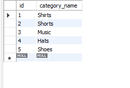
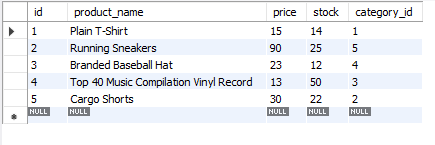
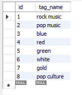
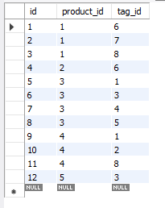
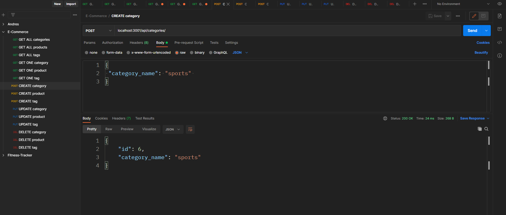
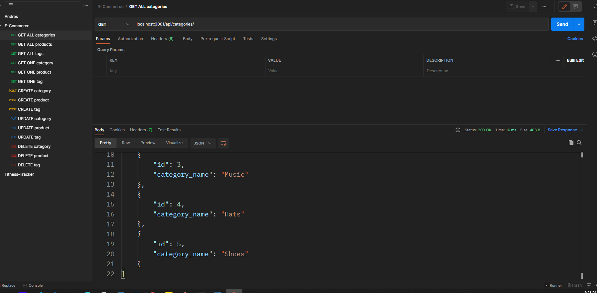
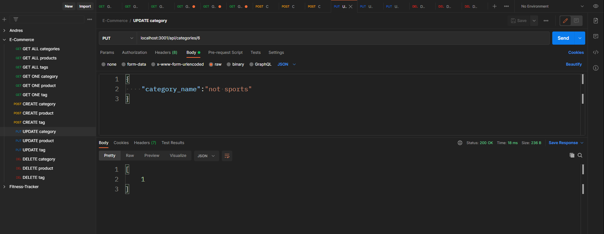
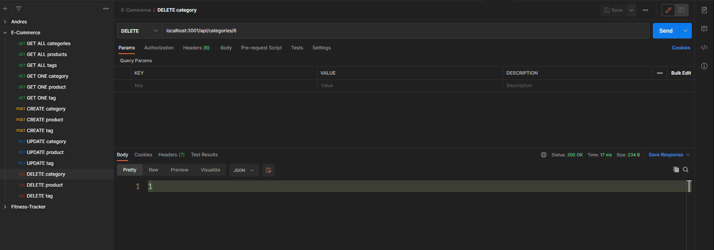

# <E-Commerce-Platform>

## Description

This Node.js application is run from the command-line, powered by sequelize and linked to a SQL database. It will allow the user to create a database as well as to seed the Categories, Products, Tags and ProductTags tables. Using a client simulator such as Postman or insomnia, the user will be able to perform CRUD operations such as CREATE new data (new category, new product and/or new tag); READ data (one/all category(ies), one/all product(s) or one/all tag(s); UPDATE and/or DELETE data from the database tables. 

Database manipulation is necessary to gain knowledge and make informed decisions. A robust system to read, create or update data regarding the company departments, roles and employees will allow the correct maintenance and usability of the database.

This application will help me practice promises, RESTful API, CRUD operations, mySQL, sequelize and Express Js.

## Table of Contents
- [<E-Commerce-Platform>](#e-commerce-platform)
  - [Description](#description)
  - [Table of Contents](#table-of-contents)
  - [Installation](#installation)
  - [Usage](#usage)
  - [Credits](#credits)
  - [GitHub](#github)
  - [Features](#features)

## Installation

1. Go to the GitHub repo in the [Github](#github) section of this readme,
2. Clone the repo,
3. Create a .env file to store the environment variables,
4. Populate the .env file with the following code and type in your database name, username and pasword:
    DB_USER=''
    DB_PW=''
    DB_NAME='',
5. Install [Postman](https://www.postman.com/downloads/),
6. Open the CLI and cd into your local folder of the application,
7. Follow the instructions on the #Usage section of this README.

## Usage

This application is run from the command line and using a client simulator such as Postman.
Once you have installed Postman and completed the steps from the [installation](#installation) section, 
1. go to your local folder root and open the CLI.
2. From there, install the necessary npm dependencies by running the command: 'npm install'.
3. Open your dabase manager, such as MySQL Workbench and run the SQL commands found in the 'db/schema.sql' file. This will create the ecommerce_db database.
4. Now, seed the database by running 'npm run seed' from your CLI.
5. Check that the tables have been created and seeded in your database manager. They should appear as follows:

6. Initialize the server by running the command 'node server.js'.
7. Make calls to the following endpoints using Postman:
   1. CREATE OR READ
      1. localhost:3001/api/categories/
      2. localhost:3001/api/products/
      3. localhost:3001/api/tags/
   2. READ ONE
      1. localhost:3001/api/categories/:id
      2. localhost:3001/api/products/:id
      3. localhost:3001/api/tags/:id
   3. UPDATE or DELETE
      1. localhost:3001/api/categories/:id
      2. localhost:3001/api/products/:id
      3. localhost:3001/api/tags/:id
   
8. Check the changes made to the data on your database manager.

Next some examples of what the route testing should look like in Postman.

For more usage instructions, check this [walkthrough video](https://watch.screencastify.com/v/TCQn9PkA4gJ2lWx95gSN)

## Credits

- [Node.js](https://nodejs.dev/learn)
- [npm](https://www.npmjs.com/)
- [Express](https://expressjs.com/)
- [mySQL2-npm](https://www.npmjs.com/package/mysql2#using-promise-wrapper)
- [MySQL](https://www.mysql.com/)
- [MySQL documentation](https://dev.mysql.com/doc/)
- [Postman](https://www.postman.com/downloads/)
- [Sequelize](https://sequelize.org/)

## GitHub

To learn more, feel free to visit the [repo!](https://github.com/aj-pena/E-commerce.git)

## Features

- Express
- Node.js 
- npm 
- MySQL
- Sequelize